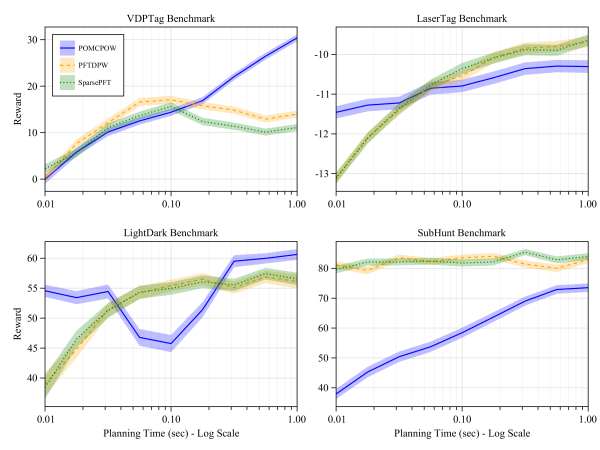
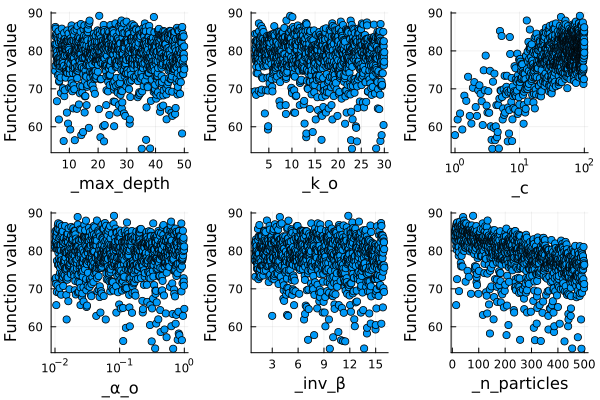

# Experiments for PFTDPW & SparsePFT

[Generalized Optimality Guarantees for Solving Continuous Observation POMDPs through Particle Belief MDP Approximation](https://arxiv.org/abs/2210.05015)



# Reproducing experimental results

Each experiment contains a `compare.jl` script that takes `iter` and `addprocs` flags.

 - `iter` dictates how many monte carlo evaluation runs to perform for each planning time and solver.
 - `addprocs` dictates how many additional workers to add.

For example, if we want to reproduce the experimental results for Laser Tag, from the experiments folder we could run the following:
```shell
julia --project LaserTag/compare.jl --iter=500 --addprocs=30
```
.

The results for experiments are stored in `experiments/<experiment_name>/data/`.


# Hyperparameter optimization
Hyperparameter optimization scripts are stored in `experiments/<experiment_name>/opt/`.

Example hyperparameter optimization results for PFT-DPW on Sub Hunt:
